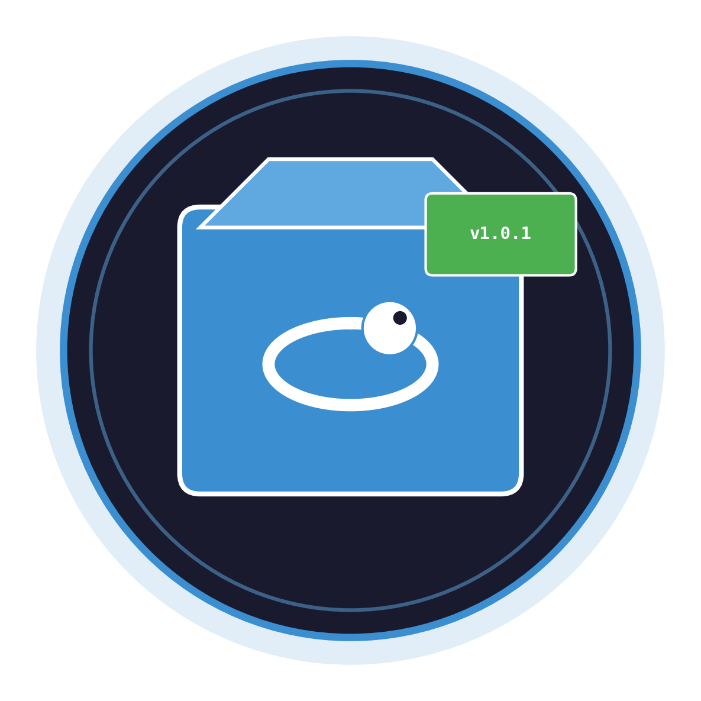
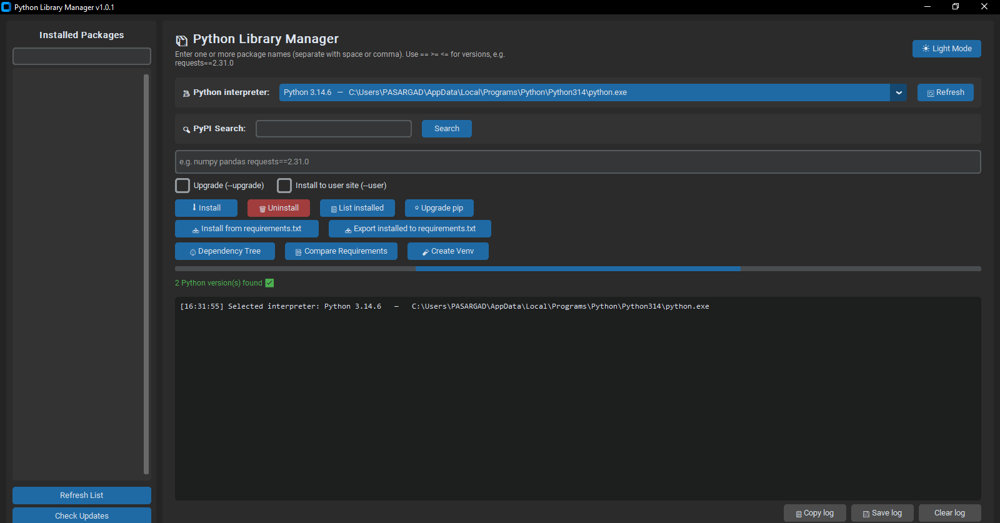
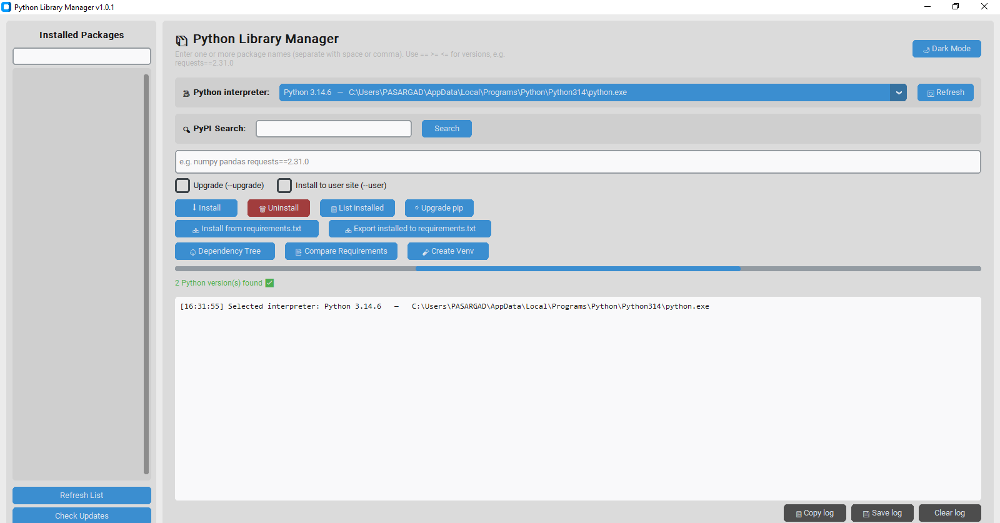
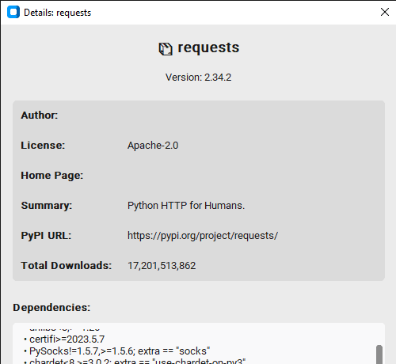
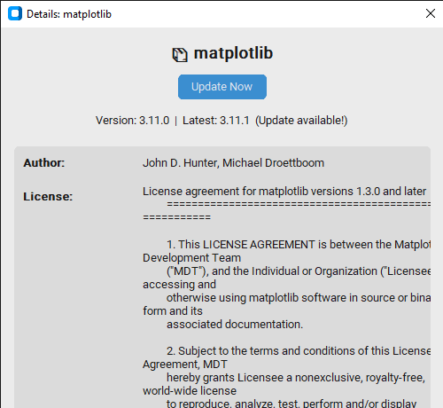
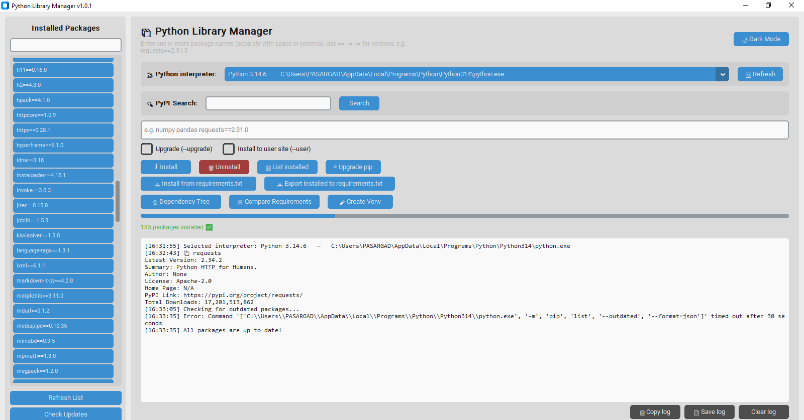
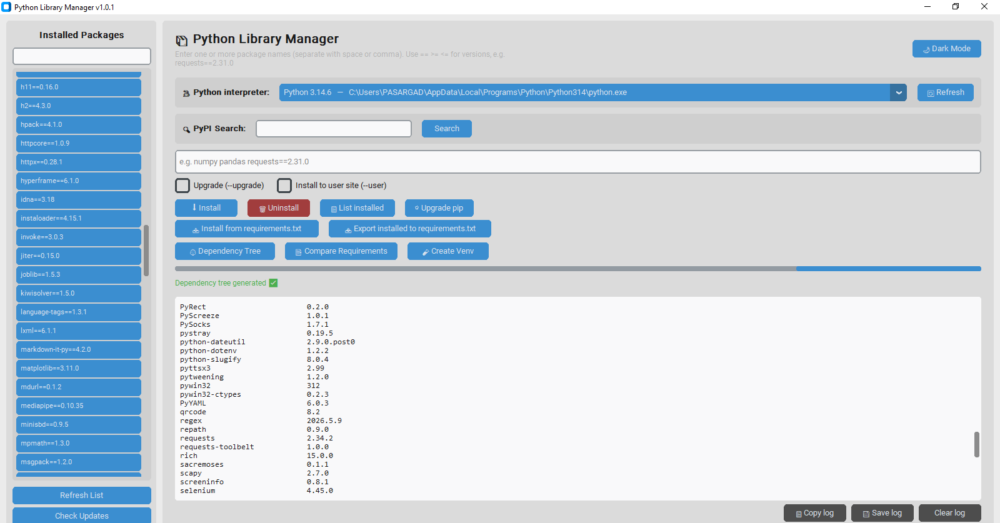
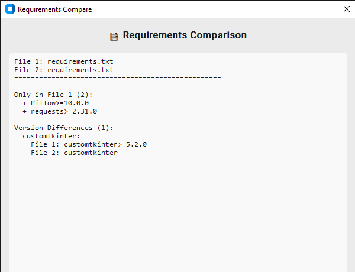
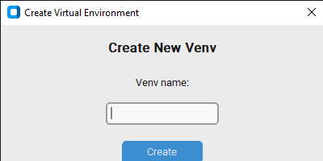

<p align="center">
  
</p>

<h1 align="center">Python Library Manager</h1>

<p align="center">
  <b>A modern, feature-rich GUI for managing Python packages with ease.</b><br>
  Built with <code>customtkinter</code> — dark mode, live logs, PyPI search, dependency trees, and more.
</p>

<p align="center">
  <a href="#features">Features</a> •
  <a href="#installation">Installation</a> •
  <a href="#usage">Usage</a> •
  <a href="#screenshots">Screenshots</a> •
  <a href="#keyboard-shortcuts">Shortcuts</a> •
  <a href="#faq">FAQ</a>
</p>

---

## Features

| Feature | Description |
|---------|-------------|
| **Multi-Interpreter Support** | Auto-detects all Python versions on your system. Switch between them instantly via dropdown. Windows `py` launcher support included. |
| **Live Command Execution** | All pip commands run in background threads. Output streams live into the log panel — no freezing, no waiting. |
| **PyPI Search** | Search any package on PyPI directly. Fetches latest version, description, author, license, homepage, and total download count in real-time. |
| **Installed Packages Panel** | Left sidebar shows every installed package with version. Click any package to inspect its metadata or check for updates. |
| **Update Checker** | One-click scan for outdated packages. Update individually or bulk-update all with a single button. |
| **Package Details** | Deep-dive into any package: Author, License, Homepage, Summary, Dependencies, and version comparison against PyPI. |
| **Virtual Environment Creator** | Create new `venv` environments without leaving the app. Automatically detects the new interpreter after creation. |
| **Requirements.txt Tools** | Import packages from `requirements.txt`, export your environment to one, or compare two files side-by-side with diff highlighting. |
| **Dependency Tree** | Visualize your package hierarchy like `pipdeptree`. Falls back gracefully if `pipdeptree` isn't installed. |
| **Dark / Light Mode** | Toggle between themes instantly. Your preference persists for the session. |
| **Auto-Complete** | Type `req` and get `requests`, `requests-oauthlib`, etc. Powered by PyPI's top 5000 packages. |
| **Safety First** | Subprocess uses argument lists (no shell strings) — fully protected against command injection. Package names validated with regex. |
| **Log Management** | Save logs to file, copy to clipboard, or clear with one click. Every line is timestamped. |

---

## Installation

### Prerequisites

- Python 3.9 or newer
- `customtkinter` (UI framework)

```bash
pip install customtkinter
```

### Quick Start

```bash
# Clone the repository
git clone https://github.com/yourusername/python-library-manager.git
cd python-library-manager

# Run the application
python python_library_manager.py
```

### Windows Standalone (No Python Required)

Download the latest release from [Releases](https://github.com/yourusername/python-library-manager/releases) and run `PythonLibraryManager.exe`.

---

## Usage

### Installing a Package

1. Select your desired Python interpreter from the dropdown.
2. Type the package name in the input field (e.g., `requests==2.31.0`).
3. Check **Upgrade** or **--user** if needed.
4. Click **⬇ Install** and watch the live log.

> **Tip:** Use comma or space to install multiple packages at once: `numpy pandas matplotlib`

### Searching PyPI

1. Enter a package name in the **PyPI Search** field.
2. Click **Search** to fetch metadata, download stats, and latest version.
3. A details popup appears with full package information.

### Checking for Updates

1. Click **Check Updates** in the left sidebar.
2. Review the list of outdated packages.
3. Click **Update** on individual packages or **Update All** to bulk upgrade.

### Creating a Virtual Environment

1. Click **🧪 Create Venv**.
2. Enter a name (e.g., `myproject-env`).
3. The new environment appears in the interpreter dropdown automatically.

### Comparing Requirements Files

1. Click **📑 Compare Requirements**.
2. Select two `requirements.txt` files.
3. View side-by-side diff showing packages unique to each file and version mismatches.

---

## Screenshots

### Main Interface — Dark Mode
<p align="center">
  
</p>

### Main Interface — Light Mode
<p align="center">
  
</p>

### PyPI Search & Package Details
<p align="center">
  
</p>

### Installed Packages Panel
<p align="center">
  
</p>

### Update Checker
<p align="center">
  
</p>

### Dependency Tree
<p align="center">
  
</p>

### Requirements Compare
<p align="center">
  
</p>

### Virtual Environment Creator
<p align="center">
  
</p>

---

## Keyboard Shortcuts

| Shortcut | Action |
|----------|--------|
| `Enter` (in package field) | Install the entered package(s) |
| `Ctrl + S` | Save log to file |
| `Ctrl + C` | Copy log to clipboard |
| `Ctrl + L` | Clear log |
| `F5` | Refresh interpreter list |

---

## Architecture

```
python_library_manager/
├── python_library_manager.py   # Main application (single file)
├── requirements.txt            # Dependencies
├── README.md                   # This file
├── screenshots/                # UI screenshots
│   ├── main_dark.png
│   ├── main_light.png
│   ├── pypi_search.png
│   ├── installed_packages.png
│   ├── update_checker.png
│   ├── dependency_tree.png
│   ├── requirements_compare.png
│   └── create_venv.png
└── assets/
    └── logo.png
```

### Why Single-File?

The entire application is intentionally contained in one Python file for maximum portability. No complex build steps, no dependency hell — just `python python_library_manager.py` and it works.

---

## FAQ

**Q: Does this work on macOS and Linux?**  
A: Yes. The interpreter auto-detection adapts to each platform. On Linux/macOS it scans `/usr/bin`, `/usr/local/bin`, and Homebrew paths.

**Q: Can I manage packages for a virtual environment?**  
A: Absolutely. Create a venv via **🧪 Create Venv**, then select it from the interpreter dropdown. All subsequent operations target that environment.

**Q: Is it safe to use?**  
A: Yes. All shell commands use `subprocess` with argument lists (no string concatenation), eliminating command injection risks. Package names are validated against a strict regex pattern.

**Q: Why does PyPI search sometimes show "N/A" for downloads?**  
A: Download counts come from the pypistats.org API. If the service is down or the package is too new, it falls back to "N/A".

**Q: Can I run this without installing anything?**  
A: If you have Python 3.9+ with `customtkinter`, yes. Otherwise, download the standalone executable from Releases.

---

## Changelog

### v1.0.1 — 2026-07-23
- **Added** PyPI search with metadata and download stats
- **Added** Installed packages panel with click-to-inspect
- **Added** Update checker with bulk update support
- **Added** Package details popup (author, license, dependencies)
- **Added** Virtual environment creator
- **Added** Requirements.txt compare tool
- **Added** Dependency tree visualization
- **Added** Dark / Light mode toggle
- **Added** Auto-complete for package names
- **Improved** Monitor-aware responsive window sizing
- **Improved** Grid layout stability — no more hidden input fields

### v1.0.0 — 2026-07-20
- Initial release with core install/uninstall/list functionality
- Multi-interpreter auto-detection
- Live threaded command execution
- Log save/copy/clear
- Requirements.txt import/export

---

## Contributing

Contributions are welcome! Please open an issue or pull request on GitHub.

1. Fork the repository
2. Create a feature branch (`git checkout -b feature/amazing-feature`)
3. Commit your changes (`git commit -m 'Add amazing feature'`)
4. Push to the branch (`git push origin feature/amazing-feature`)
5. Open a Pull Request

---

## License

MIT License — see [LICENSE](LICENSE) for details.

---

<p align="center">
  Made with ❤️ for the Python community.
</p>
